# BAMS - Best Attendance Management System

## Overview
Revolutionizing attendance tracking, our system boasts a modern UI that empowers teachers, administrators, and students with intuitive interfaces. Effortlessly manage and monitor attendance, providing a seamless experience for all stakeholders. A paradigm shift in attendance management, ensuring clarity, efficiency, and engagement.

## Table of Contents

1. [Features](#features)
2. [Installation](#installation)
3. [Usage](#usage)
4. [Project Structure](#project-structure)
5. [Technologies Used](#technologies-used)
6. [UI](#ui)
7. [Contributing](#contributing)
8. [License](#license)

## Features

This app provides features for efficiently managing attendance within an institution, like:

- User registration and authentication
- Attendance recording
- Attendance reporting
- Attendance analytics
- Attendance correction
- Class/Session creation
- Role based access control
- Data security & privacy
- Export stored data

## Installation

### Backend

1. Navigate to the `backend` directory.
2. Install dependencies: `pip install -r requirements.txt`.
3. Run the migrations for the project: `python manage.py migrate`.
3. Run the backend server (after going inside `backend/bams` folder): `python manage.py runserver`.

### Frontend

1. Navigate to the `frontend/bams` directory.
2. Install dependencies: `npm install` or `yarn install`.
3. Set up the frontend environment variables according to [.env.example](`/frontend/bams/.env.example`).
4. Run the frontend app: `npm run dev`.

## Project Structure

The project follows a monorepo structure. The backend related code is stored in the `/backend` folder and the frontend related code is stored in the `/frontend` folder.

## Technologies Used
- Backend:
    - Django REST Framework
    - SQLite
- Frontend:
    - NextJS 14 (app router)
    - shadcn
    - Tanstack Query, Table
    - recharts

## UI

### Dashboard (Light)
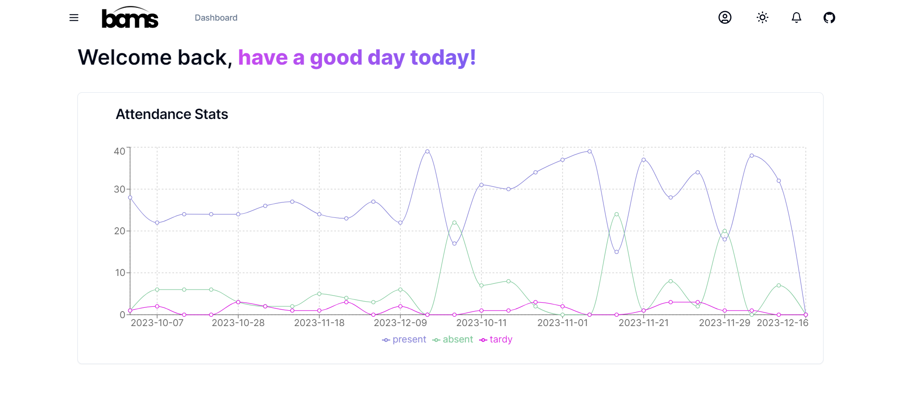

### Dashboard (Dark)
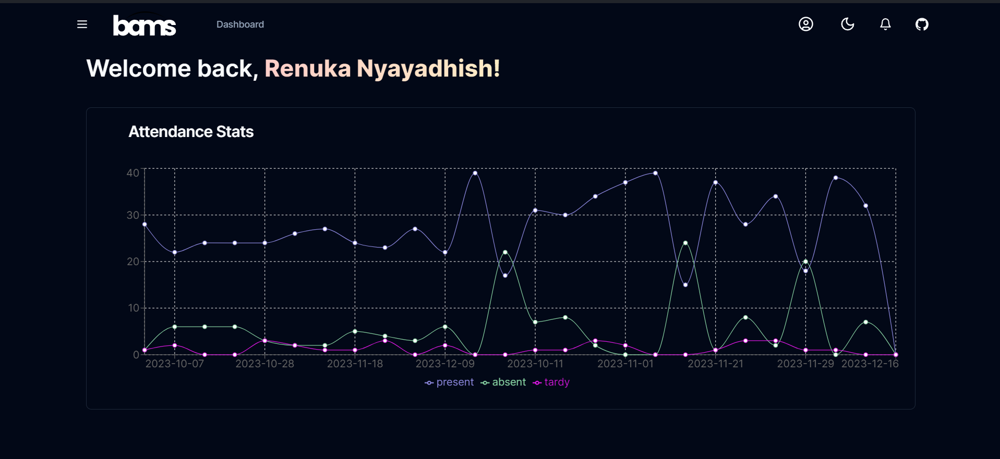

### Courses
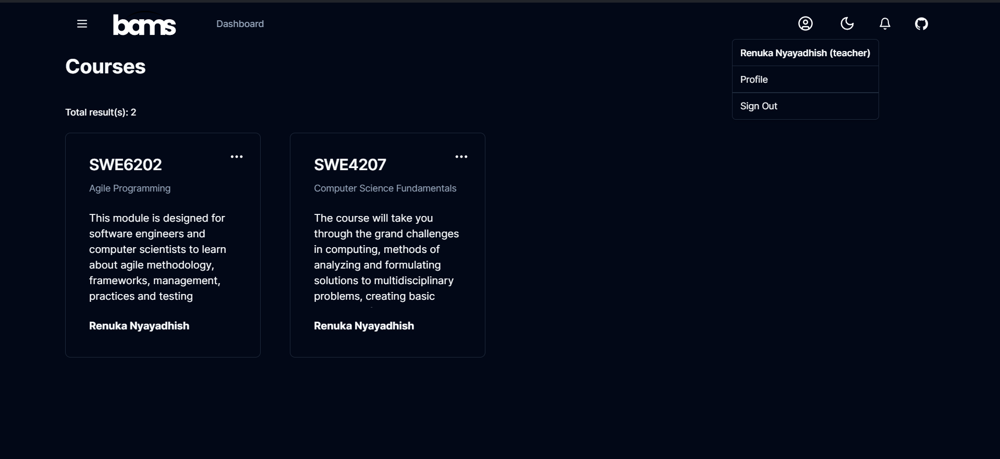

### Classes
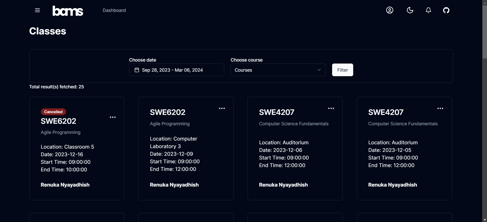

### Add Classes
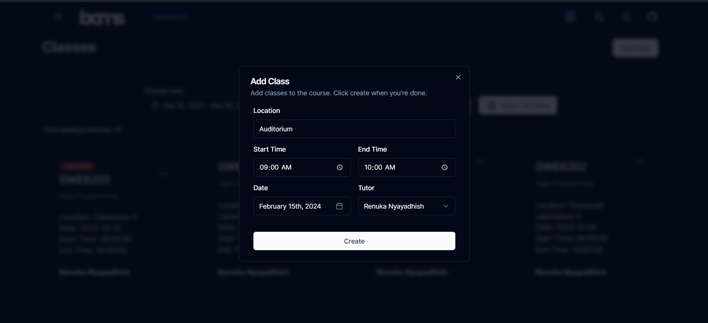

### Mark Attendance
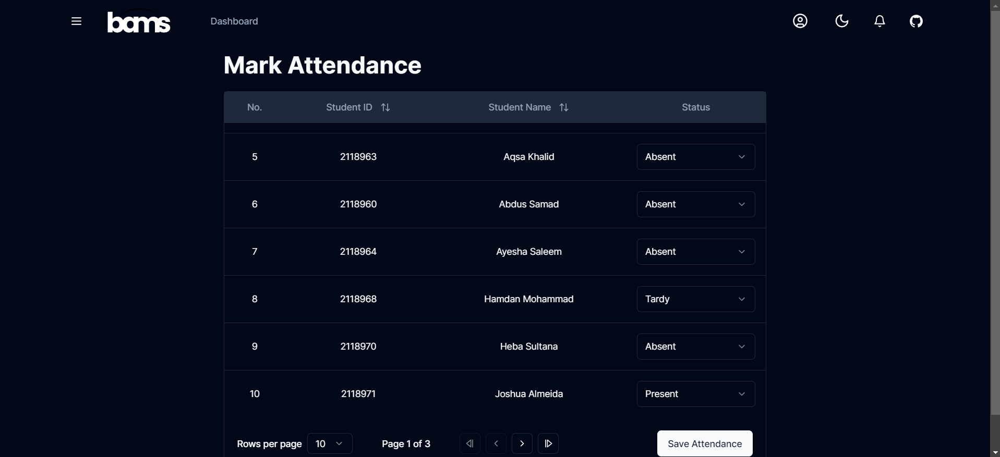

### Course Attendance
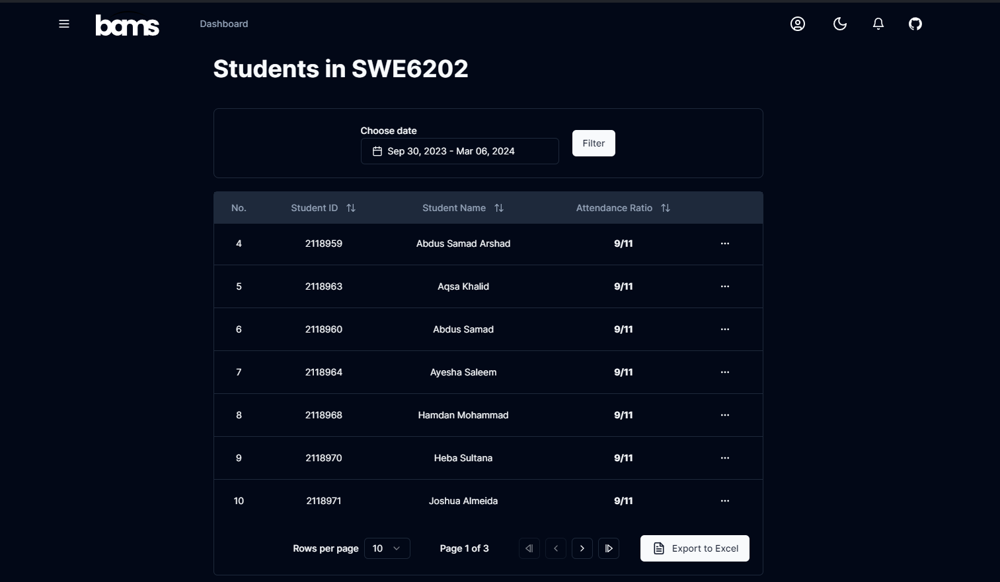

### Absentee Application
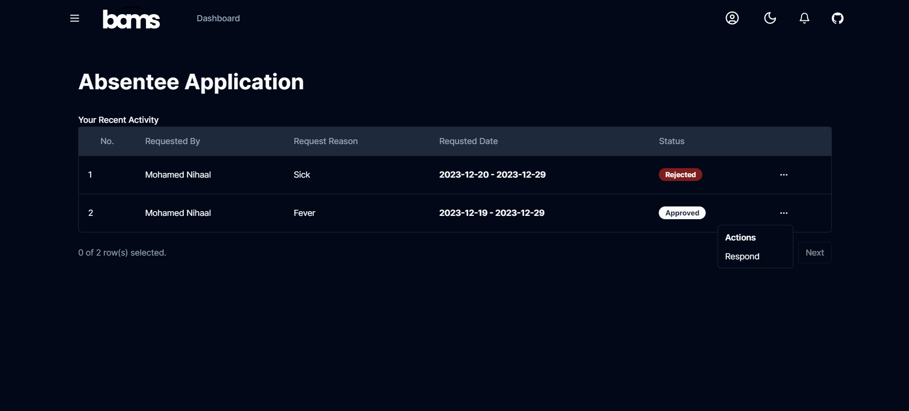

### Absentee Application Response
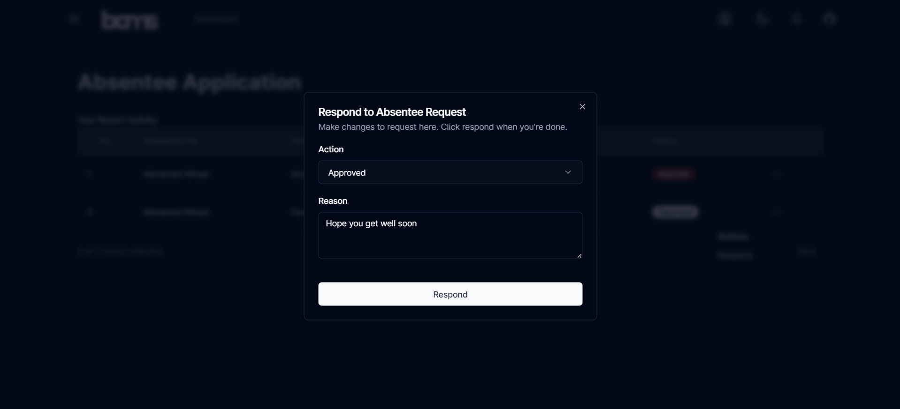

### Sidebar
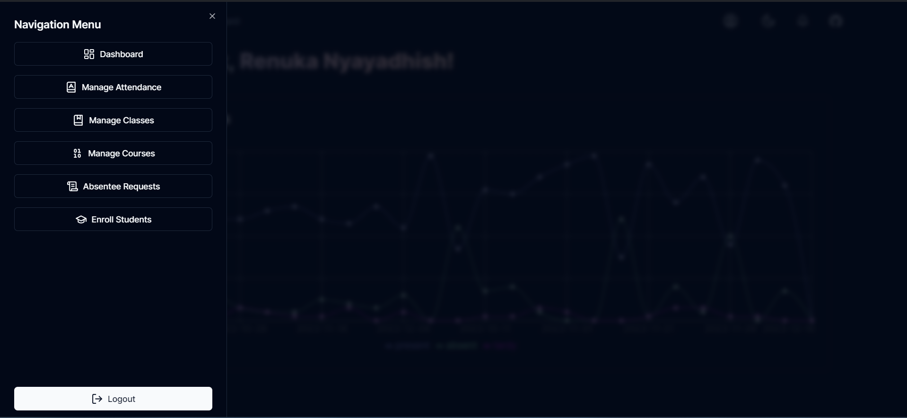

### Login
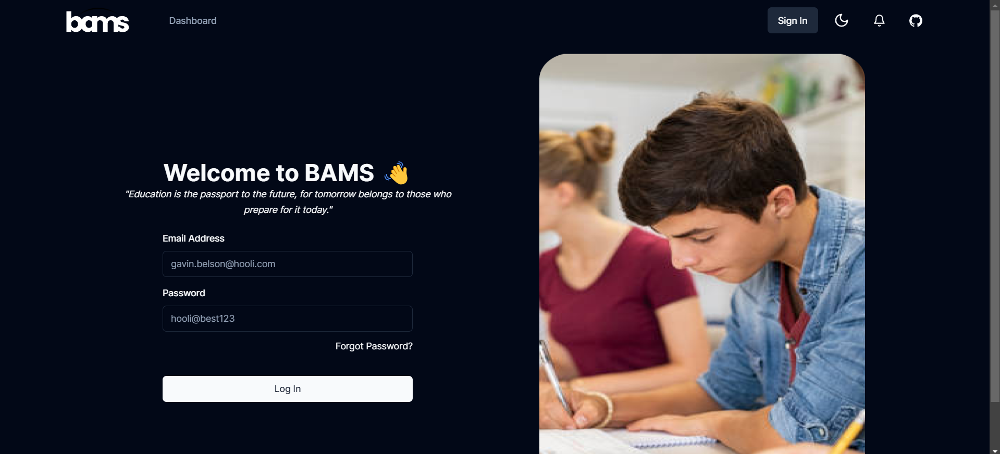

## Contributing
Contributions to this project are welcome! If you find a bug or have an enhancement in mind, please open an issue or create a pull request.

## License
This project is licensed under the MIT License. See the [LICENSE](/LICENSE) file for details.
